# 数据库服务基础模块增强设计文档

## 概述

本设计文档描述了对现有 Vue + Electron 桌面应用的数据库服务模块的增强，包括 better-sqlite3 的集成优化、数据库服务模块的完善，以及一个简单的增删改查管理界面的实现。

### 项目背景
- 基于 Vue.js 3.2.13 + Electron 13.0.0 的桌面应用框架
- 已集成 better-sqlite3 v8.7.0 作为本地数据存储
- 现有数据库服务类需要功能增强和错误处理优化
- 需要提供用户友好的数据管理界面

### 核心目标
1. 优化 better-sqlite3 集成，移除降级方案，确保稳定性
2. 增强数据库服务模块，提供完整的 CRUD 操作和数据验证
3. 实现一个功能完整的数据管理界面
4. 建立规范的前后端通信机制

## 技术架构

### 系统架构图

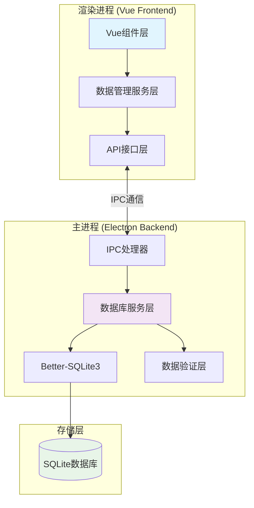

### 数据流架构

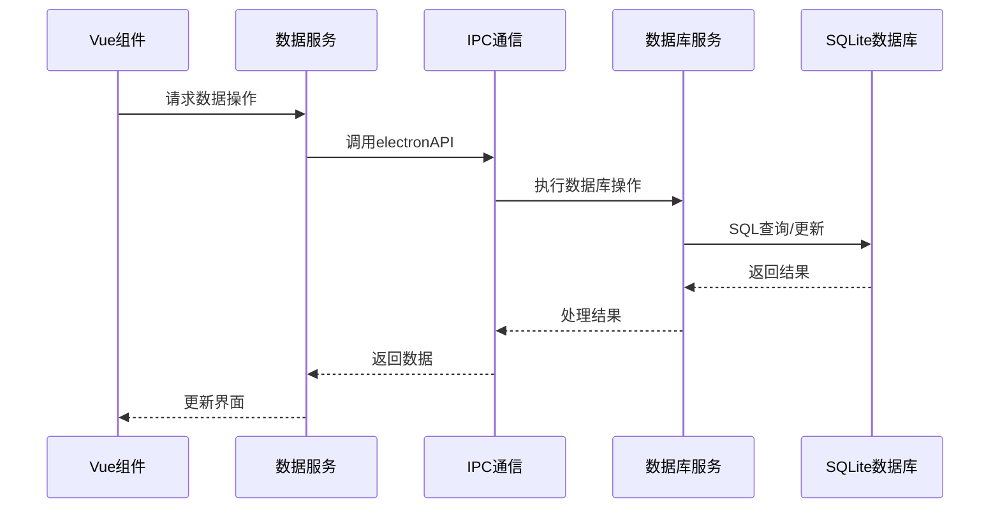

## 组件架构

### 前端组件层次结构

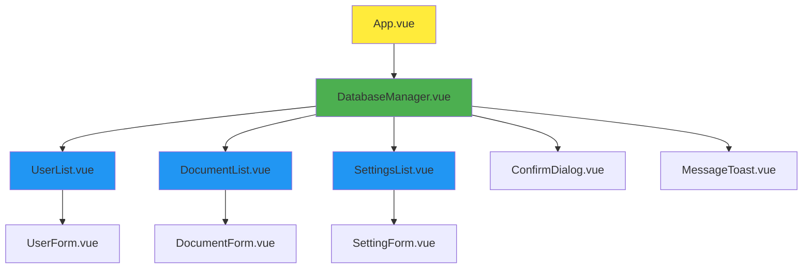

### 服务层架构

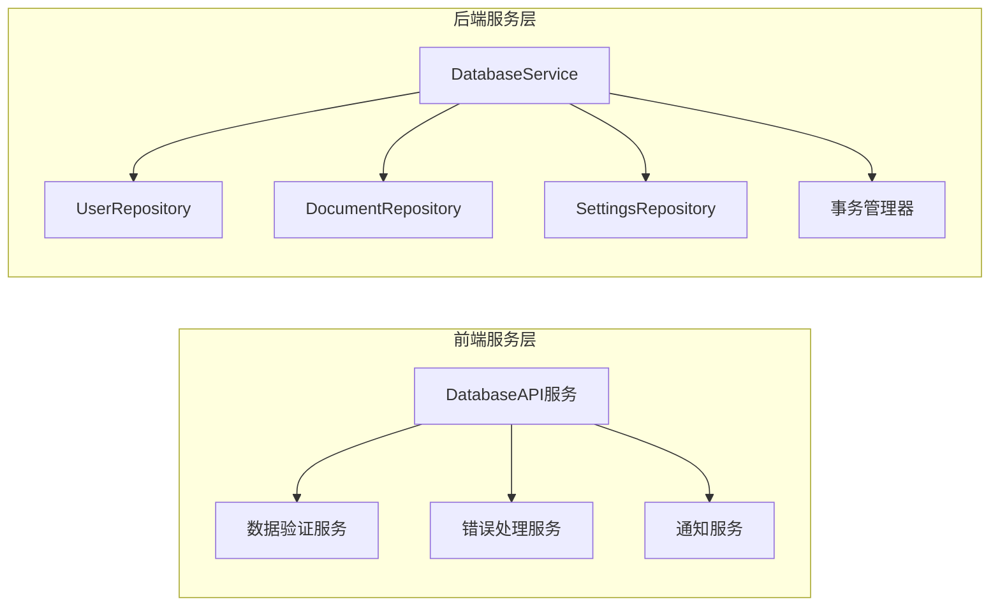

## 数据模型设计

### 数据库表结构

| 表名 | 用途 | 主要字段 |
|------|------|----------|
| users | 用户信息管理 | id, username, email, created_at |
| documents | 文档管理 | id, title, content, created_at, updated_at |
| settings | 应用配置 | key, value, updated_at |

### 用户表 (users)

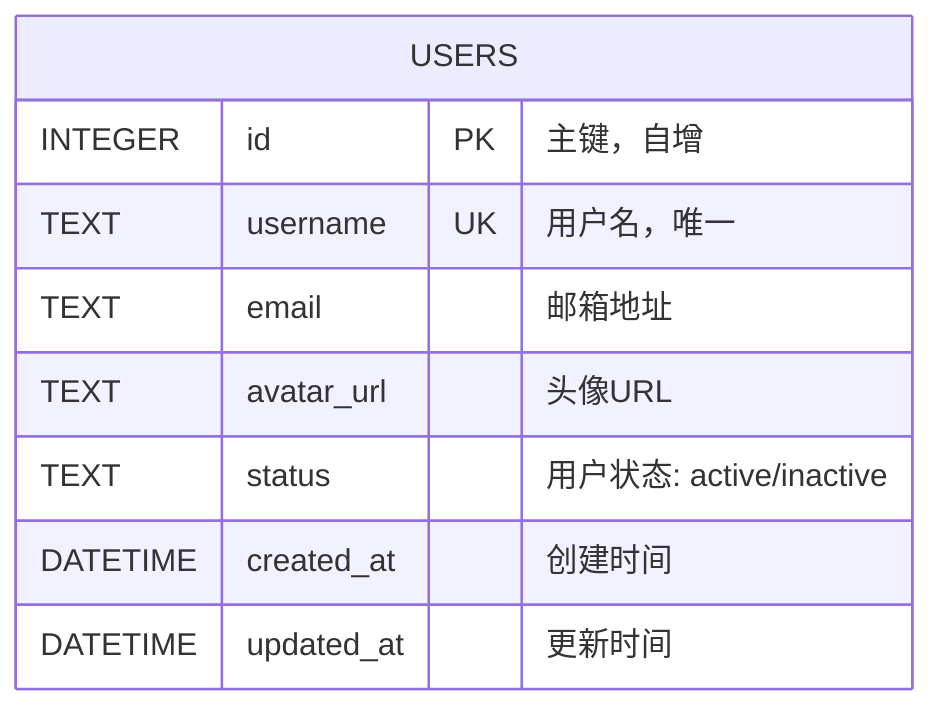

### 文档表 (documents)

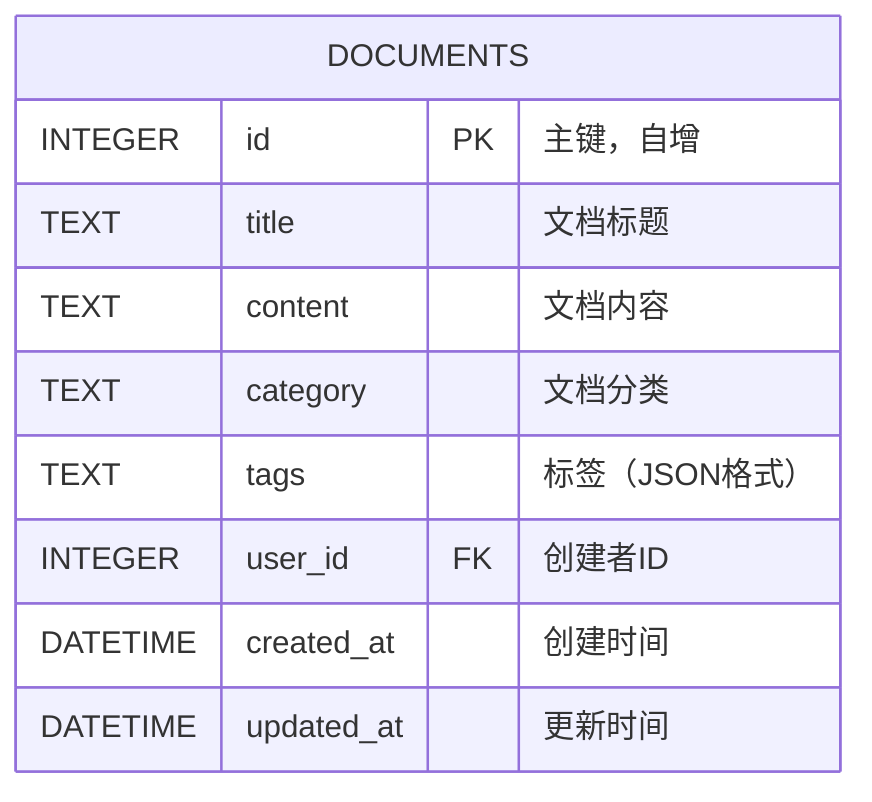

### 设置表 (settings)

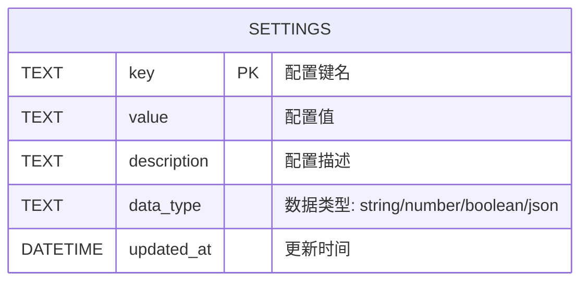

## API接口设计

### IPC通信接口

| 接口名称 | 参数 | 返回值 | 说明 |
|----------|------|--------|------|
| database-query | {sql, params} | {success, data, error} | 执行查询操作 |
| database-execute | {sql, params} | {success, changes, lastID, error} | 执行增删改操作 |
| database-transaction | {operations} | {success, error} | 执行事务操作 |
| database-backup | {path} | {success, error} | 数据库备份 |

### 数据操作API

#### 用户管理API

| 方法 | 接口 | 参数 | 说明 |
|------|------|------|------|
| getUsers | SELECT查询 | {page, limit, search} | 获取用户列表 |
| createUser | INSERT | {username, email, avatar_url} | 创建用户 |
| updateUser | UPDATE | {id, username, email, avatar_url, status} | 更新用户 |
| deleteUser | DELETE | {id} | 删除用户 |

#### 文档管理API

| 方法 | 接口 | 参数 | 说明 |
|------|------|------|------|
| getDocuments | SELECT查询 | {page, limit, category, user_id} | 获取文档列表 |
| createDocument | INSERT | {title, content, category, tags, user_id} | 创建文档 |
| updateDocument | UPDATE | {id, title, content, category, tags} | 更新文档 |
| deleteDocument | DELETE | {id} | 删除文档 |

#### 设置管理API

| 方法 | 接口 | 参数 | 说明 |
|------|------|------|------|
| getSettings | SELECT查询 | {} | 获取所有设置 |
| updateSetting | UPSERT | {key, value, description, data_type} | 更新设置 |
| deleteSetting | DELETE | {key} | 删除设置 |

## 数据库服务层

### 增强的数据库服务类

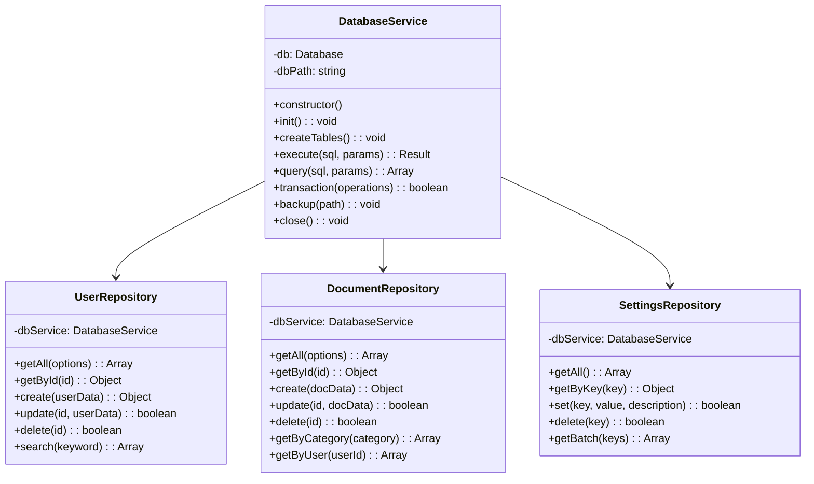

### 数据验证层

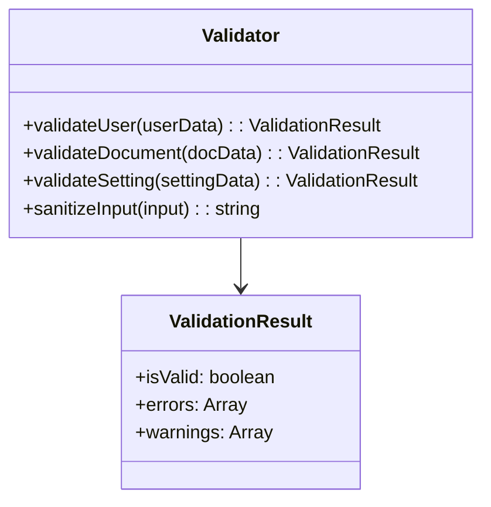

## 用户界面设计

### 主界面布局

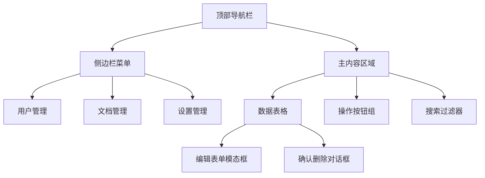

### 组件交互流程

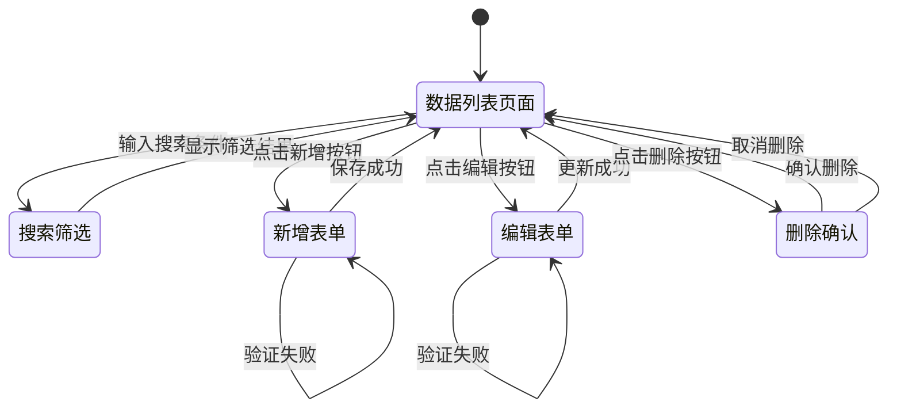

## 错误处理机制

### 错误处理策略

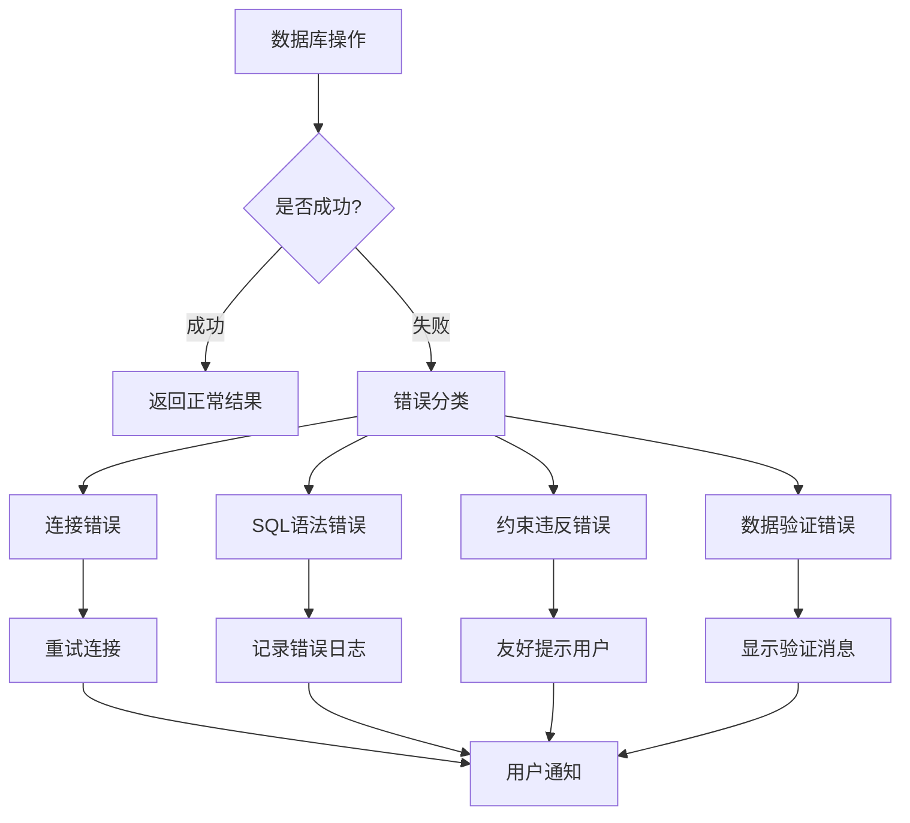

### 错误类型定义

| 错误类型 | 错误代码 | 处理方式 | 用户提示 |
|----------|----------|----------|----------|
| 数据库连接失败 | DB_CONN_ERROR | 重试连接 | "数据库连接异常，请重试" |
| SQL语法错误 | SQL_SYNTAX_ERROR | 记录日志 | "操作失败，请联系管理员" |
| 数据验证失败 | VALIDATION_ERROR | 显示详细信息 | "请检查输入信息" |
| 权限不足 | PERMISSION_DENIED | 显示权限提示 | "没有执行此操作的权限" |
| 数据不存在 | DATA_NOT_FOUND | 刷新列表 | "数据不存在或已被删除" |

## 测试策略

### 单元测试覆盖

| 测试模块 | 测试内容 | 测试工具 |
|----------|----------|----------|
| DatabaseService | 数据库连接、CRUD操作、事务处理 | Jest |
| Repository层 | 数据访问逻辑、参数验证 | Jest |
| Vue组件 | 组件渲染、用户交互、数据绑定 | Vue Test Utils |
| IPC通信 | 消息传递、错误处理 | Electron测试工具 |

### 测试用例设计

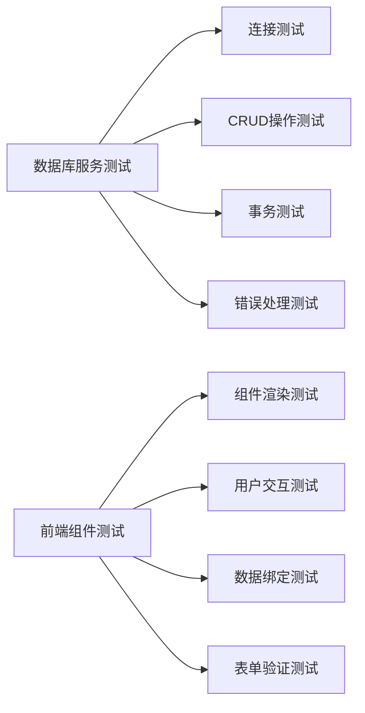

## 性能优化

### 数据库优化策略

| 优化项 | 实现方式 | 预期效果 |
|--------|----------|----------|
| 查询优化 | 添加索引、优化SQL语句 | 提升查询速度50% |
| 分页加载 | 实现前端分页组件 | 减少内存占用 |
| 连接池 | 复用数据库连接 | 提升并发性能 |
| 缓存机制 | 缓存常用查询结果 | 减少数据库访问 |

### 前端性能优化

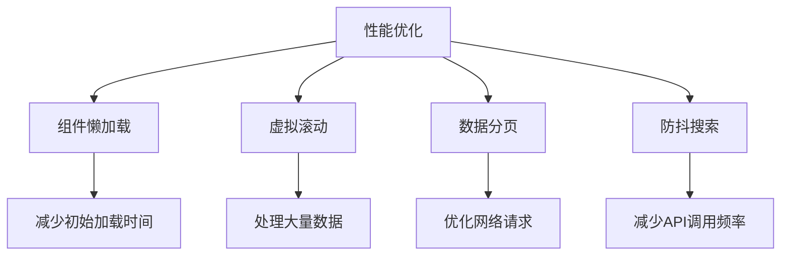